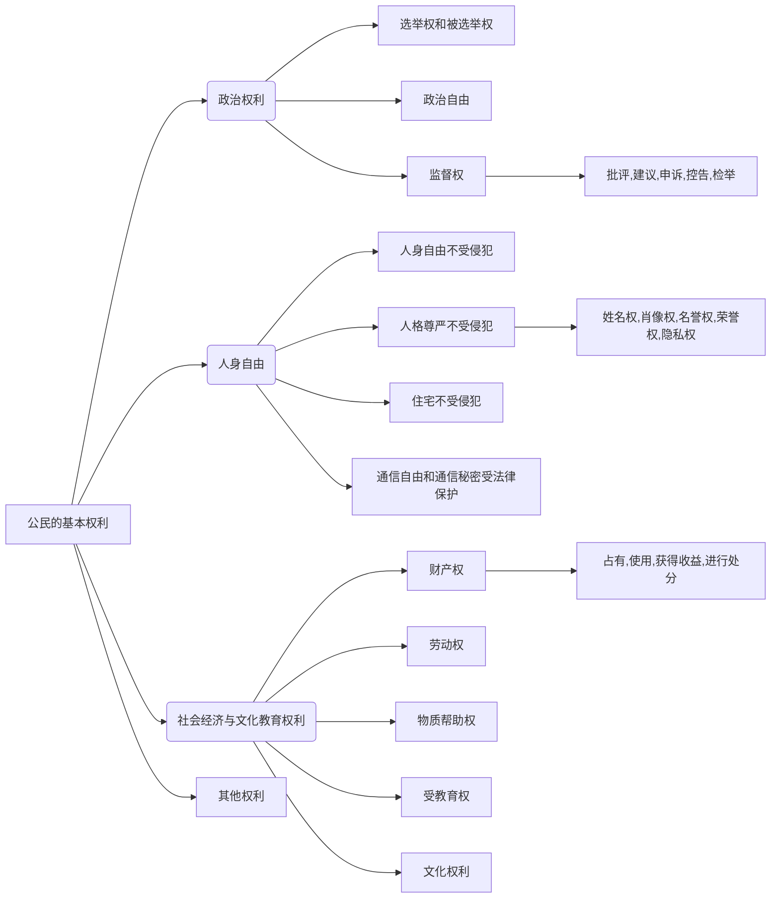

## 公民的基本权利

```mermaid
graph LR
公民的基本权利--> A(政治权利)
A-->选举权和被选举权
A-->政治自由
A-->监督权
监督权-->批评,建议,申诉,控告,检举
公民的基本权利-->B(人身自由)
B-->人身自由不受侵犯
B-->人格尊严不受侵犯
人格尊严不受侵犯-->姓名权,肖像权,名誉权,荣誉权,隐私权
B-->住宅不受侵犯
B-->通信自由和通信秘密受法律保护
公民的基本权利-->C(社会经济与文化教育权利)
C-->财产权
财产权-->占有,使用,获得收益,进行处分
C-->劳动权
C-->物质帮助权
C-->受教育权
C-->文化权利
公民的基本权利-->其他权利
```
